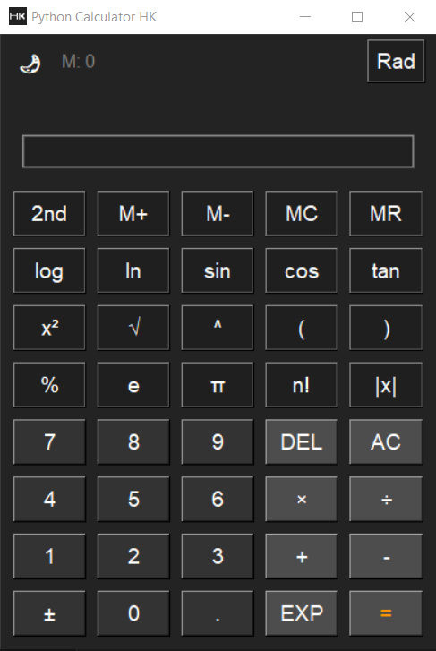
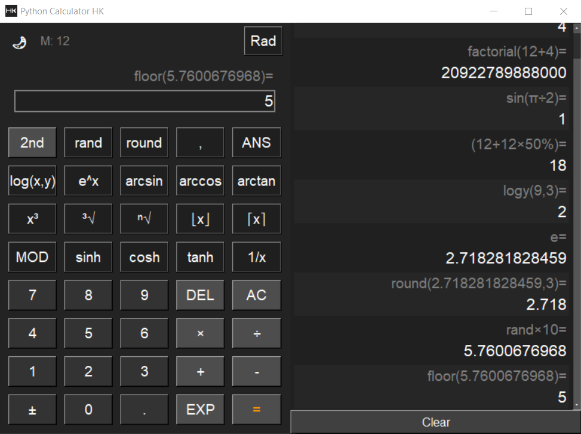
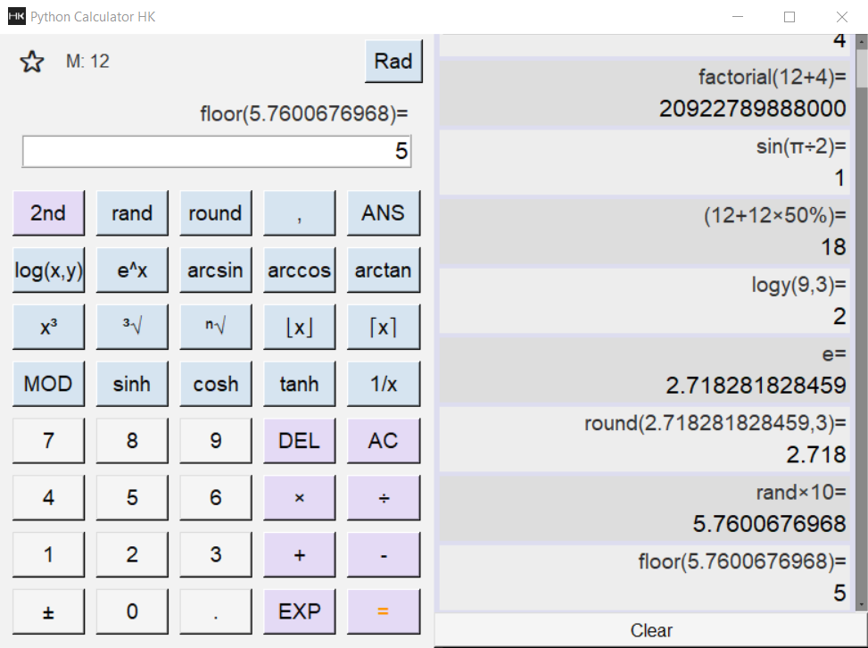

# HK Scientific Calculator
A professional, modular scientific calculator built in Python and Tkinter — packaged as a standalone executable with custom theming and extensive functionality.

---

## 🎯 Table of Contents

- [Features](#-features)
- [Screenshots](#-screenshots)
- [Installation & Usage](#-installation--usage)
- [Keyboard Shortcuts](#-keyboard-shortcuts)
- [Advanced Usage](#-advanced-usage)
- [Building from Source](#-building-from-source)
- [Troubleshooting](#-troubleshooting)
- [Project Structure](#-project-structure)
- [Contributing](#-contributing)
- [License](#-license)

---

## ⭐ Features

- 🧮 Scientific & Mathematical: `sin`, `cos`, `tan`, `log`, `ln`, `√`, `xⁿ`, `π`, `e`, `!`, and more  
- 🔄 Dual Function Modes: Switch primary/secondary functions with the `2nd` button  
- 💾 Memory Operations: `M+`, `M-`, `MR`, `MC`, with on-screen indicator  
- 📜 History Panel: View and reuse past calculations  
- 🧠 Smart Input: Auto-parentheses and syntax validation  
- 🎨 Themes: Light/Dark mode toggle (`q`)  
- 🖥️ Responsive UI: Dynamic layout & font resizing  
- ⌨️ Keyboard First: Full hotkey support  
- 📐 Rad/Deg Toggle: Angle unit switching (`R`)  
- 📦 Standalone Executable: No Python install required  

---

## 🖼️ Screenshots





---

## 💾 Installation & Usage

### 🪟 Windows (Executable)

1. Download `HK_Calculator.exe` from [Releases](https://github.com/alihk1684/HK_Calculator/releases)  
2. Double-click to run — no installation required

---

## 🐍 Run from Source

```bash
git clone https://github.com/yourusername/HK_Calculator.git
cd HK_Calculator
pip install -r requirements.txt  # If applicable
python src/main.py
```
---

## ⌨️ Keyboard Shortcuts
| Key        | Action                  |
|------------|--------------------------|
| 0–9, `.`   | Input digits/decimal     |
| `+ - * /`  | Basic operations         |
| `Enter` / `=` | Compute result        |
| `Backspace` | Delete character       |
| `Esc`      | Clear all (AC)           |
| `2nd`      | Toggle 2ⁿᵈ functions     |
| `r`        | Radians / Degrees        |
| `q`        | Toggle theme             |
| `h`        | Toggle history panel     |

Function Shortcuts:

| Key | Primary Function | Key | 2ⁿᵈ Function |
|-----|------------------|-----|--------------|
| `s` | sin(             | `S` | sinh(        |
| `c` | cos(             | `C` | cosh(        |
| `t` | tan(             | `T` | tanh(        |
| `g` | log(             | `G` | logy(        |
| `l` | ln(              | `(` | (            |
| `x` | x²               | `X` | x³           |

and more, press H to see hot keys.

---

## 🚀 Advanced Usage

- 🖱️ Click a history item to reuse its expression
- 📋 Right-click on the result to copy it to clipboard
- 🎨 Customize themes in `yi_config.py`
- 💡 Enable persistent history by modifying `logic.py`

---

## 🛠️ Building from Source

```bash
pyinstaller --noconfirm --onefile --windowed ^
  --name=HK_Calculator ^
  --icon=docs/HK.ico ^
  --add-data "docs/HK_png.png;docs" ^
  src/main.py
```
- 🗃️ Output: dist/HK_Calculator.exe
- 🧹 Cleanup: Delete build/, dist/, *.spec if desired

---

## ⚠️ Troubleshooting

| Issue |	Solution |
|-------|----------|
| iconphoto() error |	Ensure it's called right after Tk() creation |
| Missing images | Use resource_path() for packaging compatibility |
| Missing modules |	Run: pip install -r requirements.txt (if you use one) |
| Broken EXE | Make sure paths are relative and correct in --add-data; rebuild EXE |

---

##📁 Project Structure

```css
HK_Calculator/
├── docs/
│   ├── HK.ico
│   ├── HK_png.png
│   └── screenshots/
├── src/
│   ├── main.py
│   ├── logic.py
│   ├── utils.py
│   └── yi_config.py
├── HK_Calculator.exe
└── README.md
```

---

## 👤 Author
Ali Heidari Khezri
Electrical Engineering student @ K.N. Toosi University of Technology
💡 Passionate about programming, automation, and creating useful tools

---

## 🤝 Contributing

- Pull requests welcome!
- Fork this repo
- Create a new feature branch
- Commit your changes
- Open a pull request

---

## 📝 License
This project is licensed under the MIT License.
